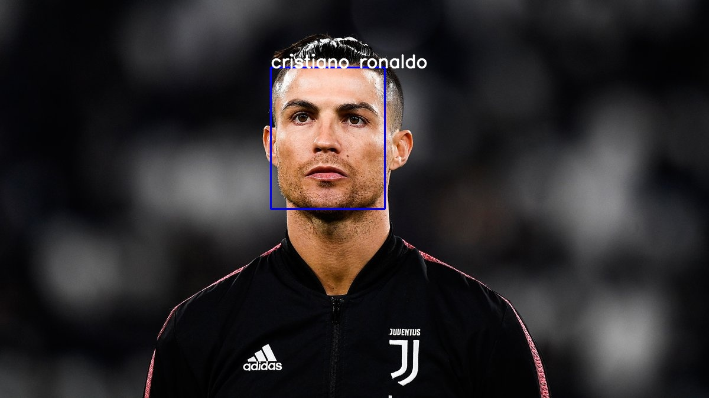
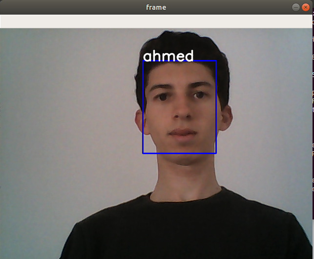

# Face Recognition Using Facenet and mtcnn 

## Inspiration

Last week i finished Convolution Neural Networks  course of the Deep learning specialization on coursera , during this course , i've learned different techniques of facial recognition systems , and i had the idea to implement a real time facial recogniton using my webcam .


### Dependencies

-   python 3.7
-   tensorflow v1.14
-   keras
-   openCV 4.2.0.32

### Usage

1.  Create a dataset of faces for each person like this : 

```
images folder  
│
└───Person 1
│   │───IMG1
│   │───IMG2
│   │   ....
└───Person 2
|   │───IMG1
|   │───IMG2
|   |   ....

```

2. If you want to recognize faces from images : 
   place some images for test in test_images folder , run images.py , you   will find results in images_reco  . 
    
    
    
   for real time recognition  : 
   run video.py 
   
